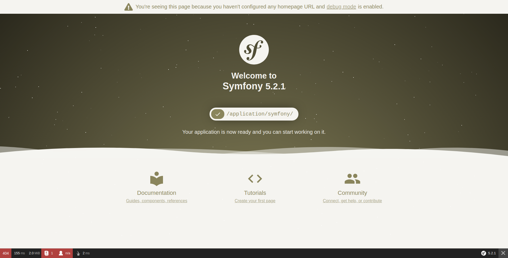

# docker-symfony


### Containers

 - [nginx](https://hub.docker.com/_/nginx) : latest
 - [php-fpm](https://hub.docker.com/_/php) : php 7.4
    - [composer](https://getcomposer.org/) 
- [mysql](https://hub.docker.com/_/mysql/) :  latest 


### Instructions

1. Clone the repository
   
   `git clone git@github.com:nicoXXXXXtitan/docker-symfony.git`
   
    `cd docker-symfony`
2. Modify the environment variables according to your settings in the `.env` file at the root of the repo.
   
3. Build/run containers 

    ```bash
        docker-compose up -d
    ```
    **Be careful**, you have to type this command at the same level as the `docker-compose.yml` file (at the root of the project).
    If not, your environment variables will not be supported.

4. if not already done, install the symfony binary on your machine :
   
    ```wget https://get.symfony.com/cli/      installer -O - | bash ```

5. Change eventually the symfony **5.2** version by another one according to your needs.

    Type this command **at the root** of the project :

    ```bash
   symfony new symfony --full --version=5.2 --no-git
    ```

    Why --no-git?
If I don't put this option, Symfony will generate a `.git` file in the symfony folder. It's annoying if you already have a `.git` file to initialize at the root of the repo.

5. By going to http://localhost you must have this page:



6. To see your database mySQL, go here http://localhost:8080/
   
7. To use the Symfony maker, the best is to be in the php container.

    Execute this command to communicate with the running php container
    ```
      docker exec -it  php_fpm bash
      cd symfony
    ```

8.  You can then use symfo commands, such as `bin/console make:controller`.
  
    To exit the container, execute `exit`

## Comment :
In order not to lose the database data every time the mysql container is turned off, a mysql volume is present in the `/database` folder.


## How it works?

Have a look at the `docker-compose.yml` file, here are the `docker-compose` built images:

* `mysql`: This is the MySQL database container
* `phpmyadmin`: this is the container of an interface for MySQL database management systems
* `php-fpm`: This is the PHP-FPM container in which the application Symfony volume is mounted,
* `nginx`: This is the Nginx webserver container in which application volume is mounted too,
